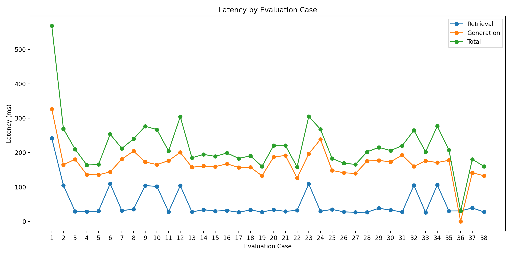
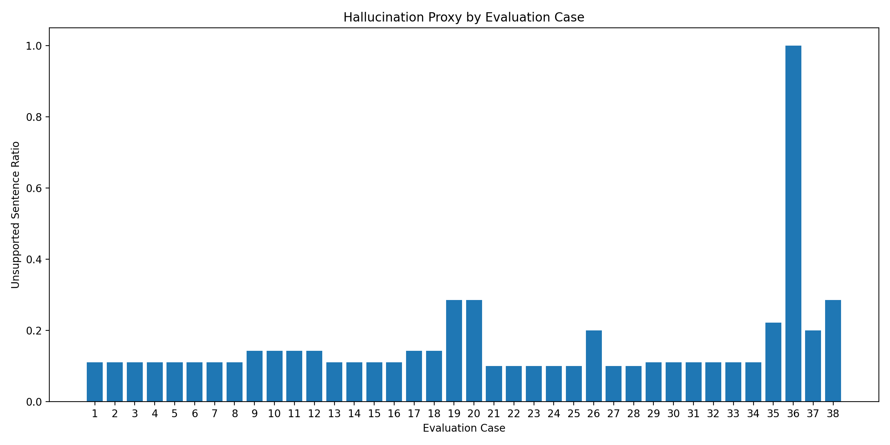

# RAG Policy Copilot

A RAG application for answering questions over policy manuals, contracts, and internal documents using hybrid retrieval, grounded citations, and confidence-based abstention.

This implementation demonstrates how to build a more reliable document QA system by combining dense and sparse retrieval, reranking, citation-backed answers, and abstention when supporting evidence is weak. 

## Features

### Ingestion
- PDF, TXT, MD, HTML support
- Structure-aware parsing

### Retrieval
- Dense (embeddings) + sparse (BM25)
- Reranking

### Generation
- Citation-grounded responses
- Confidence-based abstention

### Infrastructure
- FastAPI endpoint
- API-key auth
- SQLite + FAISS storage

## Tech Stack

- Python
- FastAPI
- FAISS
- SQLite
- sentence-transformers
- pytest

## Quick Start 

### Local Environment Setup  

Clone the repository: 
```bash
git clone https://github.com/ZaneBaker2001/rag-policy-copilot.git
cd rag-policy-copilot
```
Install the required dependencies: 
```bash
pip3 install -r requirements.txt
```
Add the example environment:
```bash
cp .env.example .env
```

### Running the App

Build the index:
```bash
python3 scripts/build_index.py
```
Start the API:
```bash
uvicorn app.main:app --reload
```
Open docs:
```
http://127.0.0.1:8000/docs
```

## Docker setup

```bash
docker build -t rag-policy-copilot .
docker run --rm -p 8000:8000 rag-policy-copilot
```

## Sample Request and Response 

Sample request: 

```bash
curl -X POST http://127.0.0.1:8000/ask -H "Content-Type: application/json" \
-H "x-api-key: dev-admin-key" -d '{"question":"What is the PTO carryover policy?"}'
```

Sample response:
```json
{
  "answer": "The default PTO carryover policy is no carryover. Unused PTO expires at the end of the calendar year unless HR approves a written exception.",
  "citations": [
    {
      "source": "hr_policy.txt",
      "chunk_id": "hr_policy.txt::chunk_2",
      "page": null
    },
    {
      "source": "hr_policy.txt",
      "chunk_id": "hr_policy.txt::chunk_1",
      "page": null
    }
  ]
}
```

## Add Documents 

Supported file types include:

- .pdf
- .txt
- .md
- .html
- .htm

Two sample .txt files are provided. 

## Environment 

A sample environment file is provided for demo usage:

```bash
OPENAI_API_KEY=your_api_key_here
OPENAI_MODEL=gpt-4o-mini
EMBEDDING_MODEL=sentence-transformers/all-MiniLM-L6-v2
DATA_DIR=data/docs
STORAGE_DIR=storage
TOP_K=6
MAX_CONTEXT_CHUNKS=6
CHUNK_SIZE=900
CHUNK_OVERLAP=120
```

This file can be customized.

## Project Structure 

```text
rag-policy-copilot/
├── app/
│   ├── config.py
│   ├── db.py
│   ├── generator.py
│   ├── ingest.py
│   ├── main.py
│   ├── models.py
│   ├── retriever.py
│   └── utils.py
├── data/
│   └── docs/
├── evals/
│   ├── eval_cases.json
│   ├── hallucination_eval.py
│   ├── latency_eval.py
│   └── retrieval_eval.py
├── scripts/
│   └── build_index.py
├── storage/
│   ├── id_map.pkl
│   ├── index.faiss
│   └── rag.db
├── tests/
│   ├── test_authz.py
│   ├── test_chunking.py
│   └── test_hybrid_scoring.py
├── .env.example
├── .gitignore
├── Dockerfile 
├── README.md
└── requirements.txt
```

## API

### GET /health 

Returns service health status 

### POST /ask

Accepts a question and returns:

- An answer
- Retrieved citations
- Applied filters 
- Retrieval diagnostics

## Run Tests

```bash
python3 -m pytest -q
```

## Evaluations

To evaluate model latency:

```bash
python3 -m evals.latency_eval
```

The below plot visualizes the model's latency.

 

Key takeaways: 
- Latency is mostly stable, with total response time for most cases landing around 160–220 ms.
- The biggest contributor is usually generation latency, while retrieval latency is smaller but occasionally spikes.
- Performance is generally consistent and fast outside of a few outlier cases. 

To evaluate model hallucinations:

```bash
python3 -m evals.hallucination_eval
```

The below plot visualizes the model's hallucinations. 

 

Key takeaways: 
- The model is usually fairly grounded, with most cases clustering around an unsupported-sentence ratio of about 0.10 to 0.15.
- That suggests most answers contain only a small amount of potentially unsupported content.
- Hallucination risk is generally low-to-moderate. 

To evaluate retrievals:
```bash
python3 -m evals.retrieval_eval
```

The below table reports the model's performance on retrievals: 

| Metric         |   Value |
|----------------|--------:|
| Cases          |      38 |
| Hit@1          |  86.84% |
| Hit@3          |  86.84% |
| MRR@5          |  86.84% |
| Confident Rate |  97.37% |
| Abstain Rate   |   2.63% |

Key takeaways:
- The model operates with great confidence (97.37%).
- The model refrains from providing incorrect/inaccurate answers.
- The model can handle most of the evaluation cases (86.84%).  


